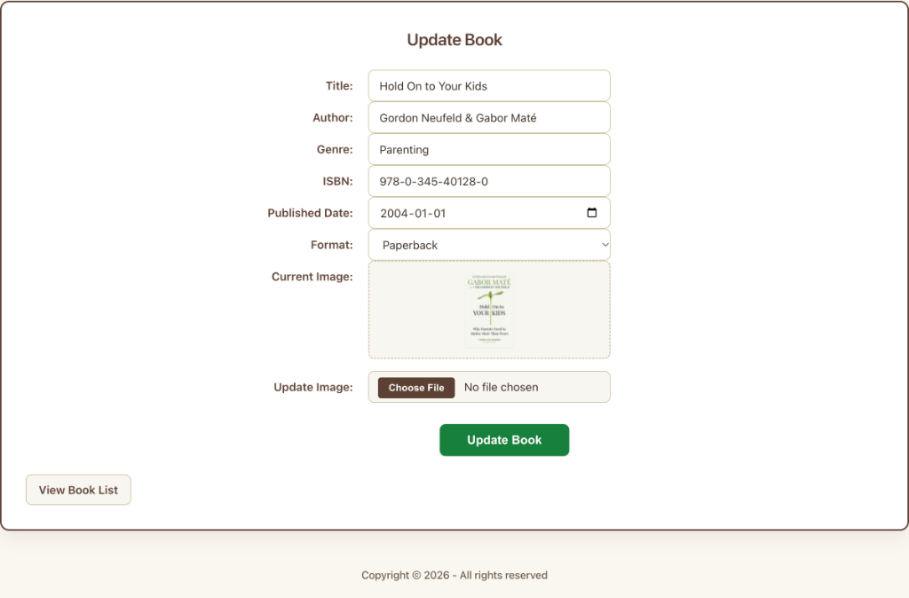

# PHP + MySQL Book Library

A full-featured PHP & MySQL web application developed iteratively across **Assignment 1**, **Assignment 2**, and **Assignment 3**. It provides complete library management with relational database design, secure CRUD workflows, and an image processing and upload pipeline.

---

## Assignment Progression & Milestones

### Assignment 1: Database Design & Initial Setup
- **Relational Schema:** Designed `book_library` database with normalized `books` and `formats` tables connected via foreign key (`formatID`).
- **Database Connection:** Centralized PDO connection with robust error handling (`database.php` & `database_error.php`).
- **Catalog View:** Main catalog table displaying book records with format relationships.

### Assignment 2: Full CRUD & Security Hardening
- **Create (Add Book):** Form with server-side validation against empty fields and duplicate ISBN detection.
- **Read / List:** Styled catalog table with responsive adaptations.
- **Update (Edit Book):** Pre-populated edit form allowing book metadata modification.
- **Delete (Remove Book):** Safe book deletion with client-side confirmation.
- **Security:** Strict PDO prepared statements across all queries and `htmlspecialchars()` output escaping against XSS and SQL injection.

### Assignment 3: Image Upload, Processing & Details View
- **Multipart Form Uploads:** Added file upload support (`enctype="multipart/form-data"`) to Add and Update forms.
- **Automated GD Image Processing:** Custom `image_util.php` module using PHP's GD library to resize and generate:
  - `_100` thumbnails ($100\times100\text{px}$) for catalog and form previews.
  - `_400` medium images ($300\times300\text{px}$) for the details page.
- **Image Preview UI:** Dynamic JavaScript preview on file selection and a responsive `.form-image-box` preview container.
- **Storage Management:** Automatic removal of old image assets upon updating book covers (preserving default placeholders).
- **Book Details Page:** Dedicated view (`book_details.php`) showcasing the enlarged cover image and full book metadata.

---

## Technologies Used

- **Backend:** PHP 8 (PDO, GD Library)
- **Database:** MySQL / MariaDB
- **Frontend:** HTML5, CSS3, JavaScript (DOM & File API)
- **Environment:** XAMPP (Apache + MySQL)

---

## Screenshots

### 1. Catalog View (All Books)


### 2. Update Book & Live Image Preview


### 3. Book Details Views
| Atomic Habits | The Psychology of Money |
| :---: | :---: |
|  |  |

---

## Setup & Installation

**Prerequisite:** XAMPP installed and running.

### 1. Project Location
Clone or place this repository inside your XAMPP `htdocs` directory:
```
/Applications/XAMPP/xamppfiles/htdocs/PHPAssignment1/
```

### 2. Start Services
Launch **XAMPP Control Panel** and start **Apache** and **MySQL**.

### 3. Database Setup (Single-Step Import)
1. Open phpMyAdmin at [http://localhost/phpmyadmin](http://localhost/phpmyadmin).
2. Go to the **Import** tab.
3. Choose `database.sql` from the root of this project and click **Go**.

The script will automatically create the database, tables, relationships, and populate seed book records and image references.

### 4. Run the Application
Open your browser and navigate to:
```
http://localhost/PHPAssignment1/index.php
```

---

## Database Configuration

Default settings in `database.php`:
- **Host:** `localhost`
- **Database:** `book_library`
- **User:** `root`
- **Password:** *(blank / empty by default in XAMPP)*

---

## Project Structure

```
PHPAssignment1/
├── css/
│   └── books2.css                # Application stylesheet with responsive media queries
├── images/
│   ├── placeholder.jpg           # Default fallback image
│   ├── placeholder_100.jpg       # Default 100px thumbnail
│   └── placeholder_400.jpg       # Default 400px details image
├── screenshots/
│   ├── all_books_catalog.png     # Screenshot of catalog table
│   ├── book_details_1.png        # Screenshot of book details view (1)
│   ├── book_details_2.png        # Screenshot of book details view (2)
│   └── update_book_form.png      # Screenshot of update form with image preview
├── add_book.php                  # Add book backend handler & image processor
├── add_book_confirmation.php     # Confirmation screen after adding a book
├── add_book_form.php             # Form to add a new book
├── add_error.php                 # Add book error view
├── book_details.php              # Full book details view with large cover
├── database.php                  # PDO database connection configuration
├── database.sql                  # Complete SQL schema, constraints & seed data
├── database_error.php            # Database connection failure screen
├── delete_book.php               # Book deletion backend handler
├── footer.php                    # Shared page footer
├── functions.php                 # Helper functions (e.g., e() for htmlspecialchars)
├── header.php                    # Shared page header and CSS link
├── image_util.php                # GD image resizing & thumbnail generation utility
├── index.php                     # Main catalog table listing all books
├── LICENSE                       # MIT License
├── README.md                     # Project documentation & assignment milestones
├── update_book.php               # Update book backend handler & image updater
├── update_book_confirmation.php  # Confirmation screen after updating a book
├── update_book_form.php          # Pre-filled edit form with live preview
└── update_error.php              # Update book error view
```

---

## License

This project is licensed under the MIT License — see the [LICENSE](LICENSE) file for details.

---

## Author

**Sheikh Naim**  
PHP Assignments (1, 2, and 3) — 2026